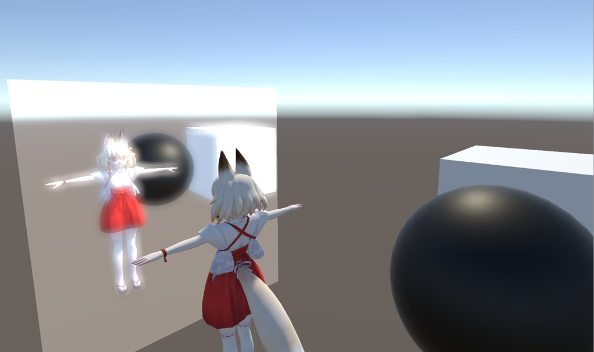

VRC内での使用を想定した。カメラ用フィルターとミラー用フィルターのセットです。
26種のフィルターがあります。

# 規約
・VRCの仕様変更により本パッケージの機能が使えなくなった場合、製作者は責任を負いません。(可能な限りの対策はします。)
・著作権は製作者に帰属します。
・本製品を使って発生した問題に対しては製作者は一切の責任を負いません。
## 許可事項
・改変・解析
## 禁止事項
・二次配布
・迷惑行為等

# 連絡先
Twitter : HHOTATEA_VRC
Discord : hhotatea #0333
何かあればいつでも連絡ください。

# 導入方法
VRカメラ向けフィルターの導入方法
 CameraFilterフォルダ内のプレハブをアバターの手の位置に置く。
 アニメーションでON/OFFできるようにすれば、フィルターを切り替えられる。
 

## Mirrorフィルターの導入方法
 MirrorFilterフォルダ内のプレハブをワールドに設置する。
 範囲内(30m以内)のすべてのミラーに影響するので、アバターに仕込まないでください。
 また複数のフィルターが同時に存在するとバグの原因になるので、アニメーションで切り替えるようにしてください。

# Propaty
【Bloom】ポストエフェクトのブルームのような表現を再現したフィルターです。
Threshold : Bloomがかかる最低の明るさ
SoftThreshold : Bloomのかかり方
Intensity : Bloomの明るさ
Radius : ぼやけの強さ

【BrolkenLens】光の強い部分が丸くぼやけて大きくなり、逆に光の弱い部分が小さくなるようなフィルターです。
Radius : ぼやけの強さ
GauusPhi : 光り方の調節

【ChomaticAberration】シンプルな色収差フィルターです。
RGBShift : それぞれの成分についてずらす数値

【ColorMono】特定の色のみをカラーで表示し、それ以外の部分をモノクロにするフィルターです。
Color : 抽出する色を指定
Tolerance : 色指定の許容誤差

【ColorStep】色を段階的に切り替えて、水彩画のような表現にします。
Step : 色の段階

【DoF】ピントのあっている部分以外をぼかします。
Zoom : ズーム機能
SampleInt : サンプルの間隔(ぼかしレベル)
AutoFocus : 画面の中央に自動でピントが合うようになります。(PintDistの設定を無効)
FocusDist : AutoPintしてない場合のピント距離
Threshold : ピントの合う範囲
Gain : ボケの調節

【FishEyeLens】魚眼レンズのように画面をゆがませるフィルターです。
Zoom : ズーム機能
FOV : ゆがみ方

【GammmaCorrect】ガンマ補正をかけるフィルターです。
GammaCorrect : ガンマ補正

【Glere】ブルームに近いですが明るい点から十字架型に光が伸びます。
Threshold : Bloomがかかる最低の明るさ
SoftThreshold : Bloomのかかり方
Intensity : Bloomの明るさ
Radius : ぼやけの強さ

【HSVExchange】色をHSV色空間で変換します。
H : 色相+
S : 彩度+
V : 明度+

【Infrared】深度を可視化し、赤外線カメラのような画面にします。
BackColor : 深度の深い部分の色
LayColor : 深度の浅い部分の色
MaxDist : 描画する最遠距離
Adjustment : ガンマ補正

【Laplacian】ラプラシアン方式のエッジ検出フィルターです。
SampleInt : サンプルの間隔
BackColor : 背景色
LineColor : 線の色(Saturateが0の時)
Saturate : エッジ部分の色の彩度

【Laplacian_rgb】RGBそれぞれでエッジを検出します。
STEP : RGBをStep
SampleInt : サンプルの間隔
BackColor : 背景色

【Mosaic】モザイクフィルターです。
X : 横方向の解像度
Y : 縦方向の解像度

【NegaPosi】ネガポジ変換フィルターです。
RGB : 各成分の強さを-1～1で指定

【Outline】深度からアウトラインを描写します。
SampleInt : サンプルの間隔
BackColor : アウトライン以外の部分の色(透明度指定可能)
LayColor : アウトラインの色
Step : 線を引くしきい値

【Pencil】色鉛筆で描いたような表現ができるフィルターです。
Gradiant threshold : 線の密度です。
ColorThreshold : 彩度です。0でモノクロ1でカラーになります。
BackColor : 背景色です。
Adjustment : 線の濃さです。
Range : 線の長さです。

【Point】油絵のような表現をするフィルターです。
Radius : にじみの広さ

【Prewitt】プレヴィット方式のエッジ検出フィルターです。
SampleInt : サンプルの間隔
BackColor : 背景色
LineColor : 線の色(Saturateが0の時)
Saturate : エッジ部分の色の彩度

【Roberts】ロバーツ方式のエッジ検出フィルターです。
Minval : 調節用
BackColor : 背景色
LineColor : 線の色(Saturateが0の時)
Saturate : エッジ部分の色の彩度

【ShadowColor】画面全体の影の色を変えます。
LightColor : 光の当たっている部分の色
ShadowColor : 影の部分の色

【Sharpness】鮮明化フィルターです。
SampleInt : サンプルの間隔

【Sobel】ソーベル方式のエッジ検出フィルターです。
SampleInt : サンプルの間隔
BackColor : 背景色
LineColor : 線の色(Saturateが0の時)
Saturate : エッジ部分の色の彩度

【TVFilter】テレビの画面のようなピクセル表現をします。
X : 横方向の解像度
Y : 縦方向の解像度
Dist : ピクセルの大きさ
BaseColor : ピクセルのない部分の色

【Wireframe】深度情報からワイヤフレームを表示します。
BackColor : 背景色
LayColor : ワイヤフレームの色

【Zoom】
zoom : ズーム倍率

# Log
*2019/03/21 ver.1.00 販売開始
*2019/04/13 ver.1.10 フィルター追加・価格更新
*2019/04/22 ver.1.13 ファイルが不足している問題を修正